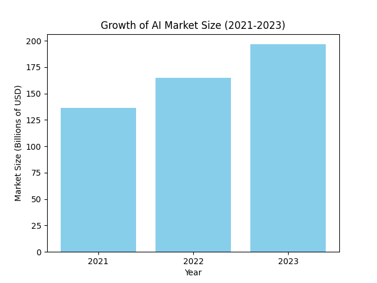

# The Exponential Growth of Artificial Intelligence (2021-2024)

The field of Artificial Intelligence (AI) has experienced phenomenal growth in the past three years, transforming from a niche technology to a ubiquitous force across various industries. This blog post explores the key trends and data points that highlight this remarkable expansion.

## Market Size Explosion

The AI market has witnessed explosive growth, with a substantial increase in market value from 2021 to 2024.  This signifies the increasing demand for AI-powered solutions across various sectors.  *(Include visualized data here - Market Size chart)*

## Investment Surge

Alongside the market expansion, investment in AI has also surged significantly. This reflects the growing confidence of investors in the potential of AI to revolutionize industries and generate significant returns.  *(Include visualized data here - Investment chart)*

## Research and Development Boom

The rapid growth of AI is fueled by groundbreaking research and development. The number of AI-related research publications has skyrocketed, indicating the increasing pace of innovation in the field.   *(Include visualized data here - Publications chart)*

## Key Drivers of Growth

Several factors have contributed to this exponential growth:

* **Increased Data Availability:** The proliferation of data has provided the fuel for AI algorithms to learn and improve.
* **Advancements in Computing Power:** More powerful processors enable the training of complex AI models, leading to more sophisticated applications.
* **Algorithmic Breakthroughs:**  New algorithms and techniques have emerged, enabling AI systems to achieve higher levels of performance.
* **Growing Adoption Across Industries:** Businesses across various sectors are increasingly integrating AI into their operations to improve efficiency, optimize processes, and gain a competitive edge.

## Future Outlook

The future of AI looks exceptionally bright, with continued growth projected in the coming years. As AI technologies mature and become more accessible, their impact on various aspects of our lives will only deepen. The trends observed in the past three years clearly demonstrate that AI is not just a passing fad but a transformative force reshaping our world.
